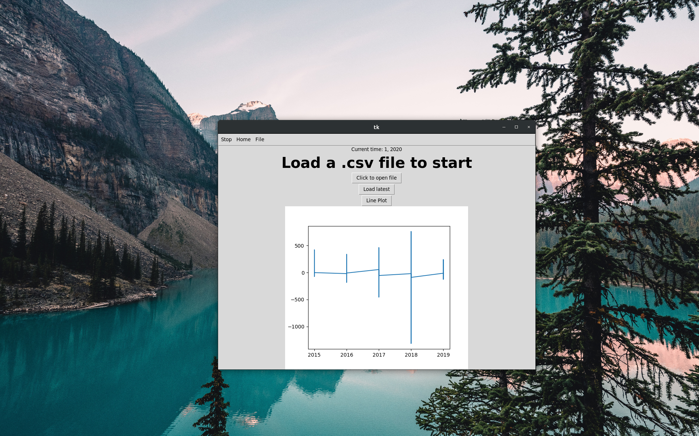

<h2>Budget Calc</h2>

<h4>This python implementation will read some financial statement in the form of .csv and perform explanatory analysis.
Additionally, it will perform predictive modeling using linear regression to budget in the future.</h4>

This will eventually use a convolutional network with convolutions trained on monthly payments (yet to be implemented)</h4>